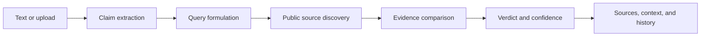

# TruthLens

> **Know what is true before you share it.**

TruthLens is an evidence-first verification workspace for claims, images, PDFs, and documents. It uses Gemini for multimodal analysis, discovers relevant public sources, compares supporting and contradicting evidence, and presents a calibrated verdict instead of an unexplained yes-or-no answer.

## Contents

- [What it does](#what-it-does)
- [How it works](#how-it-works)
- [Quick start](#quick-start)
- [API reference](#api-reference)
- [Trust and privacy model](#trust-and-privacy-model)
- [Deployment](#deployment)
- [Development](#development)
- [Project map](#project-map)
- [Known limitations](#known-limitations)
- [Author](#author)

## What it does

TruthLens is built for the moment before a claim becomes a forwarded message, post, or decision. Users can:

- Submit plain-text claims with optional context.
- Upload images, PDFs, and supported Word documents.
- See extracted claims, timelines, context, evidence strength, and verification difficulty.
- Inspect source relationships: `SUPPORTS`, `CONTRADICTS`, `CONTEXT`, or `NEUTRAL`.
- Review source quality and tiers, including official records, research, news, and fact-checking resources.
- See AI-origin signals for submitted text, images, and documents where analysis is available.
- Reopen up to 50 recent checks from local browser history.

### Verdict vocabulary

| Verdict | Meaning |
| --- | --- |
| `TRUE` | Reliable evidence clearly confirms the claim. |
| `LIKELY TRUE` | Evidence strongly supports the claim, with minor details unresolved. |
| `MIXED` | The claim combines accurate, inaccurate, or missing context. |
| `LIKELY FALSE` | Credible evidence weighs strongly against the claim. |
| `FALSE` | Reliable evidence directly refutes the claim. |
| `UNVERIFIED` | Available evidence is insufficient or inconclusive. |

## How it works



The browser handles the workspace and local history. The Express server keeps the Gemini credential private, prepares the verification request, discovers sources, and returns a structured result to the React client.

## Quick start

### Requirements

- Node.js 18+
- npm
- A Google Gemini API key with access to the configured models

### Install and configure

```bash
git clone <your-repository-url>
cd TruLance
npm install
```

Create `.env` at the project root:

```env
GEMINI_API_KEY=your_gemini_api_key_here
```

Keep the key server-side. Never put it in `src/`, commit it, or expose it through a `VITE_*` variable.

### Start development

```bash
npm run dev
```

Visit [http://localhost:3000](http://localhost:3000).

### Production build

```bash
npm run lint
npm run build
npm start
```

The build creates the browser bundle and the bundled server entry at `dist/server.cjs`.

## API reference

### `GET /api/health`

Returns a lightweight service check:

```json
{
	"status": "ok",
	"service": "TruthLens",
	"timestamp": "2026-09-04T12:00:00.000Z"
}
```

### `POST /api/verify`

Accepts JSON. At least one of `text`, `userContext`, or `fileBase64` is required.

```json
{
	"text": "The claim to verify",
	"userContext": "Optional country, date, or background context",
	"fileBase64": "Optional base64-encoded file",
	"mimeType": "Optional MIME type, for example image/png",
	"fileName": "Optional original filename"
}
```

Example request:

```bash
curl -X POST http://localhost:3000/api/verify \
	-H "Content-Type: application/json" \
	-d '{"text":"The claim to verify","userContext":"India, 2026"}'
```

Successful responses follow the shared `VerificationResult` contract in [src/types.ts](src/types.ts). They include the claim, verdict, confidence score, evidence, sources, analysis metadata, and an ISO timestamp. Invalid requests return HTTP `400` with an `error` message; upstream or server failures return an error response.

## Trust and privacy model

TruthLens is designed around transparency, not certainty theater:

- Search failure is not treated as proof that a claim is false.
- URLs are kept in the structured sources section rather than mixed into evidence prose.
- The UI exposes uncertainty, source relationships, confidence, and temporal context.
- The Gemini API key is loaded only by the server from `GEMINI_API_KEY`.
- Verification history is stored in the browser's `localStorage`, not in an application database.
- Uploaded content is processed for the verification request and is not intentionally persisted by this application.

Do not submit confidential, regulated, or personally identifiable material unless you have reviewed the privacy terms of the configured AI provider. Verification results are decision support; review the cited sources before making a high-impact decision.

## Deployment

TruthLens requires a Node-compatible server runtime. A static-only deployment cannot safely serve `/api/verify` because the Gemini credential must remain private.

### Vercel

This repository includes [`vercel.json`](vercel.json) and [`api/index.ts`](api/index.ts) for Vercel's Node.js serverless runtime.

1. Push the repository to GitHub.
2. In Vercel, choose **Add New Project** and import `shivamkumar71/TruLance`.
3. Keep the detected framework as Vite, or set the build command to `npm run build`.
4. Add `GEMINI_API_KEY` under **Settings > Environment Variables** for Preview and Production. Paste the value directly into Vercel; do not commit `.env`.
5. Deploy the project.
6. Confirm `https://<your-project>.vercel.app/api/health` returns a JSON response with `"status": "ok"`.

Vercel serves the built frontend from `dist/` and routes `/api/*` to the Express function. Do not set `npm start` as a Vercel deployment command; Vercel manages the function runtime.

Configure these production settings:

| Setting | Requirement |
| --- | --- |
| Runtime | Node.js 18 or newer |
| Build command | `npm run build` |
| Start command | `npm start` for a traditional Node host; Vercel manages this automatically |
| Secret | `GEMINI_API_KEY` in the host's protected environment settings |
| Health check | `GET /api/health` |
| Request sizing | Allow requests up to 40 MB if supporting the current upload limit |

Before release, verify the health endpoint, a text check, an image/document check, API quota behavior, and error handling. Do not deploy `.env`, `node_modules/`, or local `dist/` output from source control.

## Development

Available scripts:

| Command | Purpose |
| --- | --- |
| `npm run dev` | Start the Express and Vite development server |
| `npm run lint` | Run TypeScript validation with `tsc --noEmit` |
| `npm run build` | Build the frontend and bundle the production server |
| `npm start` | Run the compiled production server |
| `npm run preview` | Preview the Vite frontend build |

Recommended change loop:

1. Keep feature work focused and preserve the typed contracts in `src/types.ts`.
2. Run `npm run lint` after TypeScript changes.
3. Run `npm run build` before opening a pull request.
4. Keep credentials, user uploads, and machine-specific settings out of commits.

## Project map

```text
.
├── assets/                 # Static assets
├── api/index.ts            # Vercel serverless function entry point
├── src/
│   ├── components/         # Views and reusable UI components
│   ├── context/            # Shared React context providers
│   ├── App.tsx             # Navigation, verification state, and local history
│   ├── main.tsx            # React entry point
│   ├── types.ts            # Verification request and result contracts
│   └── index.css           # Global styles and theme rules
├── server.ts               # Express API, Gemini orchestration, and Vite host
├── index.html              # Browser document entry point
├── package.json            # Scripts and dependencies
├── vercel.json              # Vercel build, function, and rewrite configuration
├── tsconfig.json           # TypeScript configuration
└── vite.config.ts          # Vite configuration
```

## Known limitations

- Results depend on the quality, freshness, and availability of discovered public sources.
- AI-origin detection is probabilistic and should not be treated as authorship proof.
- Browser history is device- and browser-local; clearing site data removes it.
- The current server uses a fixed `40 MB` JSON and URL-encoded body limit.
- There is no built-in user authentication, database persistence, rate limiting, or automated end-to-end test suite yet.

## Contributing

Issues and focused pull requests are welcome. Please include the user-visible behavior being changed, the verification strategy, and any deployment or privacy impact. Before submitting:

```bash
npm install
npm run lint
npm run build
```

## Author

**Shivam Kumar**

- Email: [deepkumar14379@gmail.com](mailto:deepkumar14379@gmail.com)
- Portfolio: [shivamkumar71.netlify.app](https://shivamkumar71.netlify.app)

## License

This project is licensed under the [MIT License](LICENSE). You are free to use, modify, and distribute the software under its terms.
